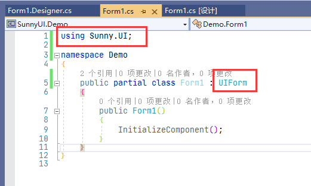
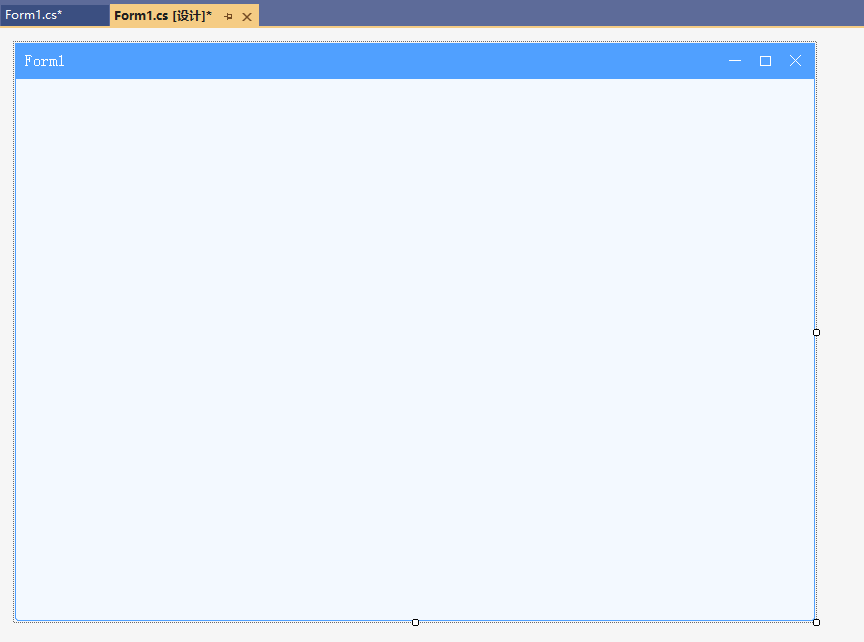
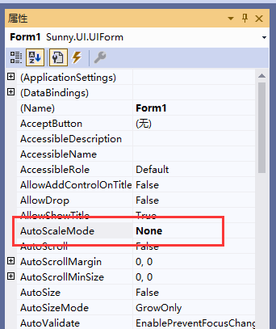

# UIForm
---
-  **UIForm** 
常用的窗体基类。

- 默认属性：Text
- 默认事件：Load
- 属性列表

| 属性        | 说明     | 类型     |  默认值   |
|-----------|--------|--------|-------|
| Style | 主题样式  | UIStyle  |  Blue     |
| StyleCustomMode | 获取或设置可以自定义主题风格   | bool  | false |
| Text  |获取或设置显示的文本  | string | -   | 
| TextAlignment| 文字对齐方式   | StringAlignment| -    |
| AllowAddControlOnTitle| 允许在标题栏放置控件  | bool |  false |
| AllowShowTitle| 允许显示标题栏 | bool |  true |
| ShowIcon | 是否显示窗体的标题栏图标 | bool   |  true |
| TitleHeight | 标题栏高度   | int | 35  | 
| TitleColor | 标题栏颜色   | Color  | -   | 
| TitleForeColor | 标题前景色（标题颜色）   | Color  | -   | 
| ExtendBox | 显示扩展按钮 | bool |  false |
| ExtendSymbol | 扩展按钮字体图标  | int |  0 |
| ExtendSymbolSize | 扩展按钮字体图标大小 | int |  24 |
| ExtendSymbolOffset | 扩展按钮字体图标偏移量   | Point | 0, 0   |
| ExtendMenu | 扩展按钮菜单   | UIContextMenuStrip  | -   |
| ControlBox | 是否显示窗体的控制按钮   | bool | true  | 
| MaximizeBox | 是否显示窗体的最大化按钮   | bool | true  | 
| MinimizeBox | 是否显示窗体的最小化按钮   | bool | true  | 
| RectColor | 边框颜色   | Color  | -   | 
| ForeColor | 字体颜色   | Color  | -   |
| StickyBorderTime| 设置或获取在显示器边缘停留的最大时间(ms)   | long | 500  | 
| IsForbidAltF4 | 是否屏蔽Alt+F4   | bool | false   | 
| EscClose| 使用Esc键关闭窗口   | bool | false   | 
| CloseAskString| 关闭时提示文字 | string |  |
| ShowFullScreen| 是否以全屏模式进入最大化 | bool | false   | 
| ShowRadius| 是否显示圆角  | bool | true| 
| ShowRect| 是否显示边框  | bool | true| 
| ShowTitleIcon | 显示标题栏图标  | bool | false   | 
| ShowDragStretch| 显示边框可拖拽调整窗体大小  | bool | false   | 
| ShowShadow| 是否显示阴影  | bool | false   | 
| Version | 版本  | string  |  -     |
| TagString | 获取或设置包含有关控件的数据的对象字符串   | string | -   | 

- 主题风格
  [主题](/theme)

- 主题设置
  设置Style属性调用系统自带主题，如果需要自定义颜色，就是更改颜色属性后，把控件的Style设置为Custom，StyleCustomMode设置为True
  StyleCustomMode就是接受用户自定义颜色的意思。

- 创建窗体  
  项目引用SunnyUI.dll和SunnyUI.Common.dll，或者从Nuget引用SunnyUI。
  详见[安装](/install)     
  
- 新建窗体：  
  
  
  修改：把Form修改成UIForm，并且 using Sunny.UI;  
  
  
  这时切换到窗体，窗体已经变为UIForm：  
  
  
  **下一步的操作非常重要：**   
  把窗体的AutoScaleMode从Font设置为None，否则可能出现因为屏幕分辨率而导致的窗体变形。  
  
  
    
  
- 拖拽调整窗体大小  
  ShowDragStretch 设置为true，显示边框可拖拽调整窗体大小。  

- 显示任务栏图标  
  设置Icon，将ShowIcon设置为true，再打开ShowTitleIcon可显示窗体标题栏图标。  

- 显示标题栏扩展按钮
  ExtendBox设置为true，可在标题栏现有按钮最小化按钮的左边显示一个扩展按钮。   
  扩展按钮的图标设置ExtendSymbol。ExtendMenu为扩展按钮点击的下拉菜单。  
